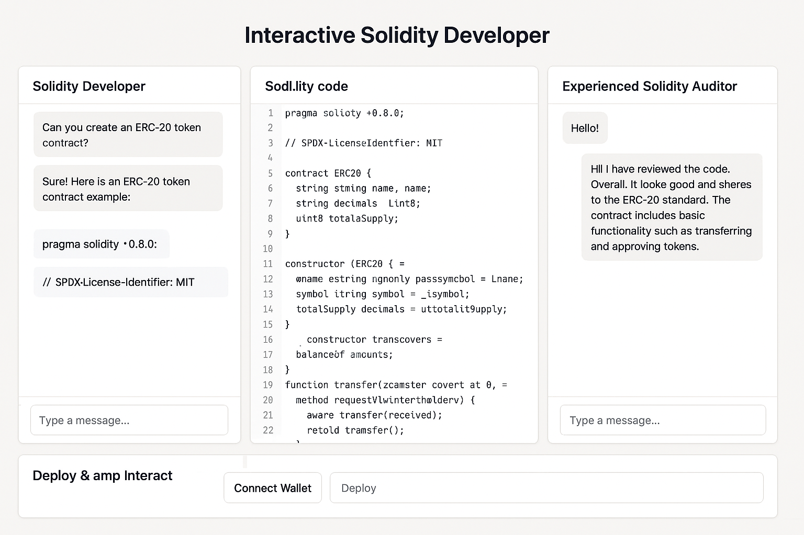

# Final Project: Interactive Solidity Developer

This tool will help efficiently write, review, deploy, and interact with Solidity contracts. 
## User interface
### Description by `@keruch`
I imagine the UX of 4 pieces:

1. **Left window**—AI model that is a Solidity Developer. It is a chat-like window where one can interact with a model instructioned to be a Solidity dev. It writes Solidity code and outputs it at the middle window.
2. **Middle window**—Solidity code editor. Model outputs its code here. One can edit the code.
3. **Right window**—AI model that is an Experienced Solidity Auditor. It is a chat-like window where one can interact with a model instructioned to be a Solidity auditor. This model audits the code in the middle window and gives remarks.
4. **Bottom window**—one can connect the wallet and deploy the written above Solidity code. Optionally, interact with the deployed contract in Remix-style.

### AI generated design


## First steps: Electron
Let's start with Electron, because VS Code is based on Electron and what we'll do is much like VS Code.

Disclaimer: the code below is made by reading the docs and has not been tested yet as of Monday 14 April 2025.

## Need to know about Electron vs. React
When introducing the Main and Renderer processes in Electron to a React developer, you can draw parallels to concepts they're already familiar with, while also highlighting the key differences. Here's a way to explain it:

### Analogy to Front-end vs. Back-end (Simplified):

Think of Electron's architecture as having a distinct 'back-end' and 'front-end', though both run locally on the user's machine.

* **The Main Process is like the 'back-end'**: It's the central brain of your application. It's responsible for things that happen behind the scenes, like managing the application window itself, interacting with the operating system (like file system access, menus, notifications), and coordinating the different parts of your application. It runs in a Node.js environment.

* **The Renderer Process is like the 'front-end'**: This is where your actual user interface lives. Each window in your Electron application gets its own Renderer Process. This process is essentially a Chromium browser instance, and it's where your React code (or any web technology like HTML, CSS, JavaScript) gets rendered and interacts with the user."

### Differences between the folders `src` and `dist`
In an Electron-based TypeScript project, the `src` and `dist` folders serve distinct and crucial roles in the development and build process. Here's a breakdown of their differences:
1. You write and edit your code in the `src` folder using TypeScript.
2. You run a build process (often using tools like `tsc` - the TypeScript compiler - and potentially other build tools like Webpack or Parcel).
3. The build process takes the TypeScript files from `src`, compiles them into JavaScript, and places the output along with other necessary assets into the `dist` folder.
4. Electron is then configured to run the JavaScript files located in the `dist` folder.
5. When you package your application for distribution, you typically package the contents of the `dist` folder.

**In summary:**

| Feature        | `src`                                  | `dist`                                      |
| -------------- | -------------------------------------- | ------------------------------------------- |
| **Purpose** | Source code, development files        | Build output, distribution-ready files     |
| **Language** | Primarily TypeScript (`.ts`)            | Primarily JavaScript (`.js`), HTML, CSS, assets |
| **Readiness** | Not directly executable by Electron    | Executable by Electron                     |
| **Modification** | Actively edited during development     | Generally not directly modified             |
| **Build Process** | Input to the build process             | Output of the build process                |

Understanding this distinction is fundamental for managing your Electron-based TypeScript project effectively. It helps you organize your code, manage the build process, and prepare your application for deployment.

### Key Differences and Analogies to React Concepts:

1.  **Environment:**
    * **Main Process:** "The Main Process runs in a full Node.js environment. This means you have access to all Node.js APIs and modules directly. Think of it like your server-side code in a full-stack React application (though it's still running locally)."
    * **Renderer Process:** "The Renderer Process runs in a browser-like environment (Chromium). This is where your familiar web APIs (DOM, `window`, `document`, `fetch`, etc.) are available. This is very similar to the environment where your React components run in a web browser."

2.  **Responsibility:**
    * **Main Process:** "The Main Process is responsible for the 'global' aspects of your application and interacting with the underlying operating system. It doesn't directly render the UI content. Think of it as handling the setup and coordination for your React front-ends."
    * **Renderer Process:** "The Renderer Process is solely focused on rendering the UI and handling user interactions within its specific window. This is where your React components, state management (like Redux or Context), and UI logic reside."

3.  **Communication:**
    * "Unlike components in React that communicate through props and callbacks within the same process, the Main and Renderer processes are separate and need a special way to talk to each other. This is called **Inter-Process Communication (IPC)**. Think of it like making API calls between your React front-end and your back-end. Electron provides mechanisms like `ipcRenderer` (in the Renderer) and `ipcMain` (in the Main) to send and receive messages."

4.  **Number of Instances:**
    * **Main Process:** "There's typically only one Main Process for your entire Electron application."
    * **Renderer Process:** "You can have multiple Renderer Processes, one for each window you open in your application. Each window will have its own isolated environment for rendering your React UI."

5.  **Analogy to `ts` and `tsx` files:**
    * "The distinction between the Main and Renderer processes isn't directly analogous to the difference between `.ts` and `.tsx` files. `.ts` files are TypeScript files that can contain any TypeScript code, while `.tsx` files specifically allow for JSX syntax within your TypeScript, which is primarily used for defining React components.
    * Think of it this way: both the Main and Renderer processes can be written in TypeScript (`.ts`). If you're building your UI with React in the Renderer process, you'll be using `.tsx` files there. The Main process, which doesn't deal with UI rendering in the same way, will typically use `.ts` files."

### Key Takeaway for a React Developer:

"As a React developer, you'll likely spend most of your time writing code that runs in the **Renderer Process** using your familiar React patterns and libraries. The **Main Process** will handle the more 'system-level' tasks and act as a bridge between your UI and the underlying operating system. You'll need to learn about IPC to enable communication between your React UI in the Renderer and the Main process for tasks that require OS-level permissions or backend-like functionality."

By framing the explanation with analogies to front-end/back-end concepts and highlighting the differences in environment and responsibility, a React developer can more easily grasp the fundamental separation of concerns in Electron's architecture. Emphasize that while the rendering part will feel familiar, the concept of a separate Main Process and the need for IPC are new concepts to learn.

## First steps: basic app
### Use Type Script
Coming from React / NextJS and using AI libraries, we are used to TypeScript. We'll use TypeScript (and possibly `ts-node`). 

We check that Node TypeScript and the libraries are installed
``` bash
node -v     # check nodejs is installed. Mine is v22.14.0
tsc -v      # check typescript compiler is installed. Mine is Version 5.6.3
ts-node -v  # check ts-node is installed. I have no ts-node
# cd to the project folder to check the node_modules
ls node_modules/@types/
```
I can still develop in TypeScript without `ts-node`. But before running a `npm` script, I must run the compiler `tsc` on my `.ts` files.
Until now, I use TypeScript in NextJS projects, this is why I don't need `ts-node`. But I don't know with Electron. Let's try without `ts-node` and see.

If we don't have TypeScript already installed, we install it with its development tools
``` bash
npm install --save-dev typescript ts-node @types/node @types/electron
```
- Install `ts-node` (if you plan to run TypeScript directly during development)
- Install the necessary type definitions `@types/node @types/electron`


Then we configure its `tsconfig.json`
``` bash
npx tsc --init --rootDir src --outDir dist --esModuleInterop --module commonjs --target ES2020 --sourceMap
```
- `--rootDir src`: Specifies the root directory for your TypeScript source files.
- `--outDir dist`: Specifies the output directory for the compiled JavaScript files.
- `--esModuleInterop`: Enables interoperability between CommonJS and ES Modules.
- `--module commonjs`: Specifies the module code generation. Electron primarily uses CommonJS.
- `--target ES2020`: Specifies the ECMAScript target version. Choose a modern version that Electron supports well.
- `--sourceMap`: Generates source map files for easier debugging.


### Initialise Electron Project Files


``` bash
mkdir ai-solidity-ide           # create project folder
cd ai-solidity-ide              # go to the folder
npm init -y                     # initialize project
npm install --save-dev electron # install electron and dependencies
```

### Configure `npm` Start Script
The command `npm init` has created a `package.json` file. We modify it to include scripts for building our TypeScript code and starting the Electron application.

The Start Script is 
``` json
{
  "name": "ai-solidity-ide",
  "version": "0.0.1",
  "description": "An interactive AI-powered Solidity coding tool built with Electron and TypeScript",
  "main": "dist/main.js",
  "scripts": {
    "build": "tsc",
    "start": "npm run build && electron ."
  },
  "author": "Group 8 of DeAI bootcamp",
  "license": "MIT",
  "devDependencies": {
    "@types/node": "^...",
    "electron": "^...",
    "typescript": "^..."
  }
}
``` 
- `build`: Compiles your TypeScript code.
- `start`: Runs the build script and then starts the Electron application. The `.` refers to the current directory, which should contain the compiled `main.js`


## Application Code
### Basic Electron application code `src/main`

``` TypeScript
import { app, BrowserWindow } from 'electron';
import * as path from 'path';

let mainWindow: BrowserWindow | null = null;

function createWindow() {
  mainWindow = new BrowserWindow({
    width: 1800,
    height: 920,
    webPreferences: {
      nodeIntegration: true,    // Allows Node.js integration in the renderer process (for now)
      contextIsolation: false,  // Disable context isolation for simplicity in this initial setup
      preload: path.join(__dirname, 'preload.js'), // Optional: for more secure context bridging
    },
  });

  mainWindow.loadFile(path.join(__dirname, '../index.html')); // Assuming your HTML is in the root
  // Or load a URL: mainWindow.loadURL('https://example.com');

  mainWindow.on('closed', () => {
    mainWindow = null;
  });
}

app.on('ready', createWindow);

app.on('window-all-closed', () => {
  if (process.platform !== 'darwin') {
    app.quit();
  }
});

app.on('activate', () => {
  if (mainWindow === null) {
    createWindow();
  }
});
```

### Basic HTML page
``` html
<!DOCTYPE html>
<html>
<head>
  <meta charset="UTF-8">
  <title>Interactive Solidity Code Tool</title>
</head>
<body>
  <h1>Welcome to the Interactive Solidity Code Tool!</h1>
  <div id="app"></div>
  <script src="./dist/renderer.js"></script> </body>
</html>
```

### Create our Renderer Process TypeScript (renderer.ts):

Create a `src/renderer.ts` file:
``` Bash
touch src/renderer.ts
``` 
Add some basic content to `src/renderer.ts`:
``` TypeScript
document.addEventListener('DOMContentLoaded', () => {
  const appDiv = document.getElementById('app');
  if (appDiv) {
    appDiv.textContent = 'This is running in the renderer process!';
  }
});
``` 

### Run the Basic Electron App:

Execute the following commands in our terminal:
``` Bash
npm install 
``` 
Think of `npm install` as setting up the toolbox for our project. We need to gather all the necessary tools (dependencies) before WE can start building. We only need to run `npm install` when the contents of our toolbox configuration (`package.json`) have changed or if the toolbox itself (`node_modules`) is missing. For simply running our already set-up project, WE don't need to run it repeatedly.

``` Bash
npm start

This should compile the TypeScript and open a basic Electron window displaying "Welcome to the Interactive Solidity Code Tool!" and "This is running in the renderer process!".

