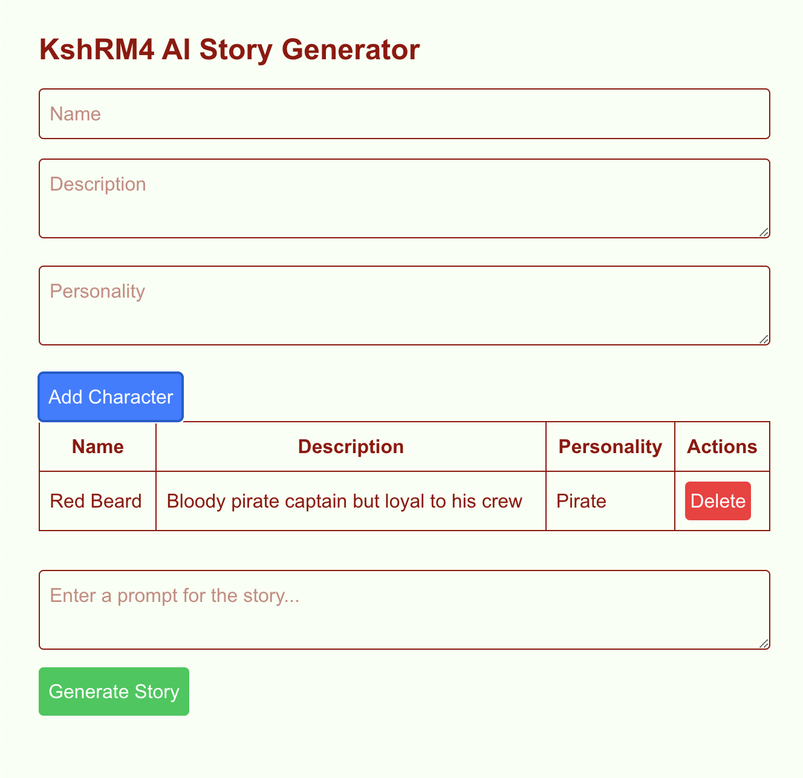

This is the project of kvutien (KshMR4) homework of week 3 of the Encode Club AI Agent bootcamp, Q1 2025. It is wiP. The UI is done but not yet the AI call.


This is a [Next.js](https://nextjs.org) project bootstrapped with [`create-next-app`](https://nextjs.org/docs/app/api-reference/cli/create-next-app).

## Getting Started

First, install the Vercel AI-SDK
```bash
npm install ai @ai-sdk/react @ai-sdk/openai zod
```
Then run the development server:

```bash
npm run dev
# or
yarn dev
# or
pnpm dev
# or
bun dev
```

Open [http://localhost:3000](http://localhost:3000) with your browser to see the result.


## Deploy on Vercel (not tested yet)

The easiest way to deploy your Next.js app is to use the [Vercel Platform](https://vercel.com/new?utm_medium=default-template&filter=next.js&utm_source=create-next-app&utm_campaign=create-next-app-readme) from the creators of Next.js.

Check out our [Next.js deployment documentation](https://nextjs.org/docs/app/building-your-application/deploying) for more details.
