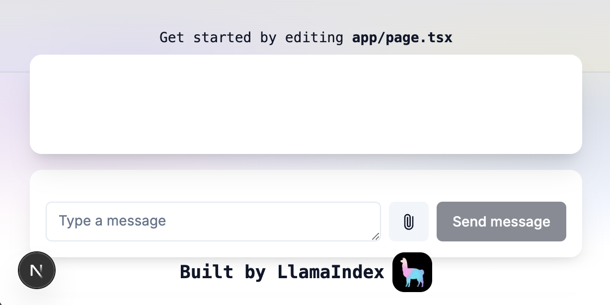
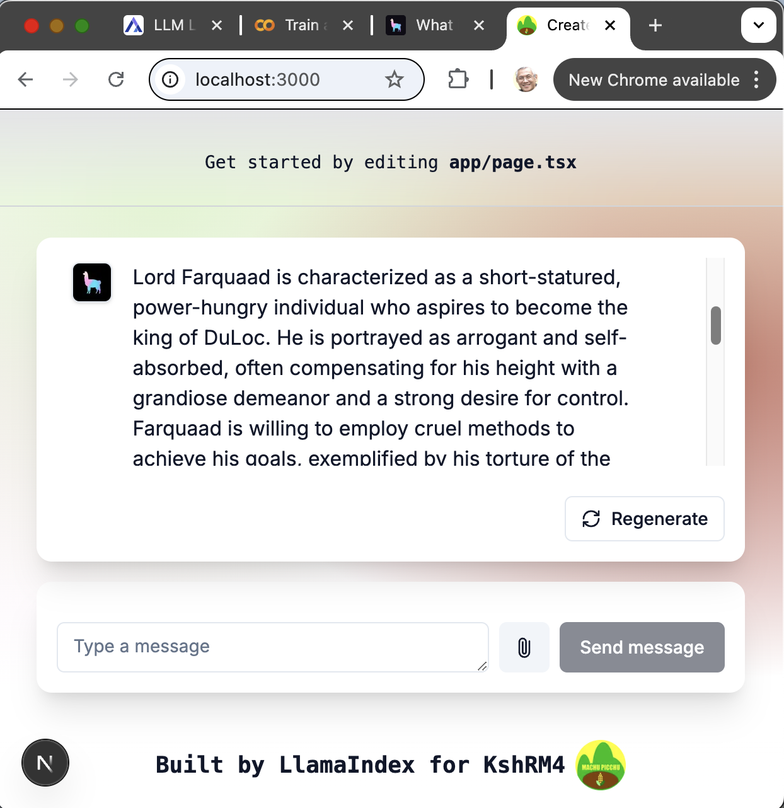

# Overview
This is the project of kvutien (KshMR4) homework of week 4 of the Encode Club AI Agent bootcamp, Q1 2025. 
- the LlamaIndex demo `rag-app` is installed in `KsHRM4-week4week4`

## Homework Assignment
The homework tasks are:
1. Design a page with a single input field for `.txt` file uploads.
2.	Users should upload a book or similar content about a theatre with characters and settings.
3.	Implement a button to extract characters from the uploaded file.
4.	Develop a RAG pipeline to extract characters from the uploaded file.
5.	Convert the output from the AI into an array of objects and present it in a table format.
(optional) Modify the retrieveandquery.ts file to use Structured Outputs to make it easier to process the response.
6.	Each character should have a name, description, and personality.
7.	Add a text area below the button to display the results.
8.	Integrate the ts-playground project with the story-telling-app to enable users to create new stories using imported characters, reusing their descriptions and personalities inside the stories being generated by the AI.

## Homework

In the exercise 1 of lesson 16, we have already done most of the home work.
1.	Design a page with a single input field for .txt file uploads.
2.	Users should upload a book or similar content.
3.	Implement a button to Extract Characters.
4.	The button will call an AI-powered function that implements a RAG pipeline to extract characters from the text in the uploaded file.
5.	Each character should have a name, description, and personality.

### First steps: the UI
Here is the result (I adapted the background and the icon, to explore the code)

in this demo app,  I managed to upload the shrek.txt file. So I continue... 

### Second step: structured output

The real work remaining to do is in the following:
1.	Convert the output from the AI into an array of objects and present it in a table format.
2.	(optional) Modify the retrieveandquery.ts file to use `Structured Outputs` to make it easier to process the response.
3.	Each character should have a name, description, and personality.
4.	Add a text area below the button to display the results.
5.	Integrate the ts-playground project with the story-telling-app to enable users to create new stories using imported characters, reusing their descriptions and personalities inside the stories being generated by the AI.

### Summary of work
- The change in UI is done in the file `/app/page.tsx`
- The change in UI is done in the file `/app/components/chat-section.tsx`
- The call to OpenAI Assistant is to be done in the file `/app/api/chat/route.ts` does the API call to OpenAI.

The rest is WiP. All text below are placeholders. 

I spent a lot of time exploring and understanding the rag-app. Anyhow, I don't have time to finish the weekend's homework.

## Deploy on Vercel

The easiest way to deploy your Next.js app is to use the [Vercel Platform](https://vercel.com/new?utm_medium=default-template&filter=next.js&utm_source=create-next-app&utm_campaign=create-next-app-readme) from the creators of Next.js.

Check out our [Next.js deployment documentation](https://nextjs.org/docs/app/building-your-application/deploying) for more details.
